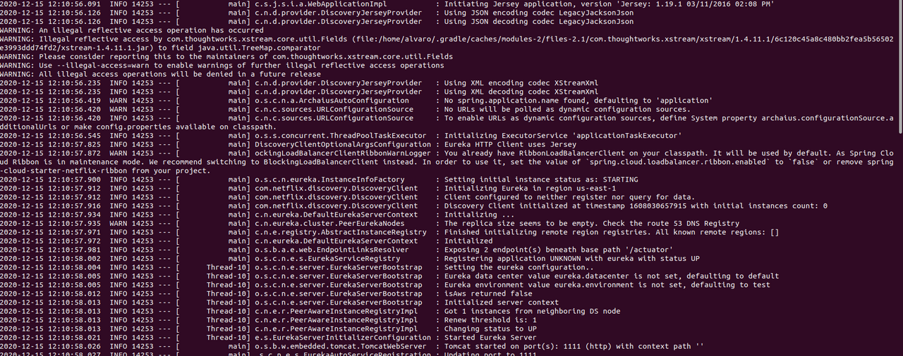

- The two microservices are running and registered
  - Accounts:

  - Web:

- The service registration service has the two microservices registered
  - Dashboard:

  - Registration:

- A second account microservice is running in the port 4444 and it is registered
  - Dashboard:

  - Accounts: 

- What happens when you kill the microservice with port 2222. Can the web service provide information about the accounts? Why?
  - In the dashboard, it dissapeared from the ACCOUNTS-SERVICE, but the web service can provide information (on the port 4444) about the accounts because there's a second accounts service running and registered on the port 4444.